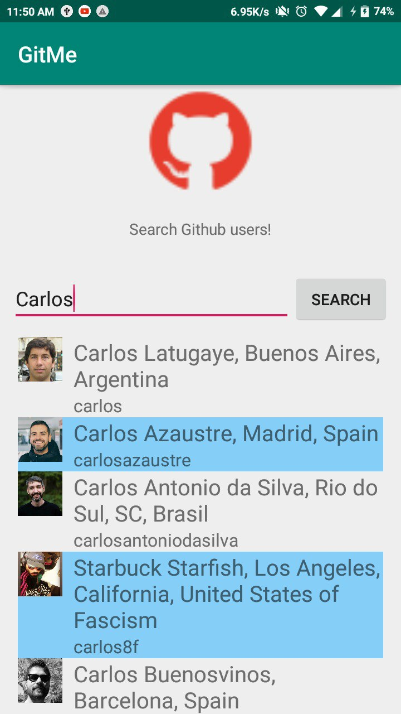

# GitMe: Github Search App

This is a sample android app for testing Github's GraphQL.

## Github Token
It's important to replace the github token in `keystore.properties` file in project root with your own token.

## Images: *version in development*

